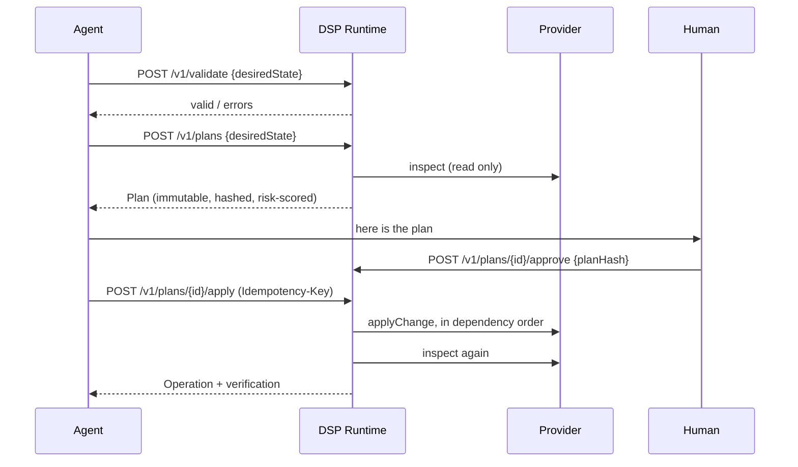

# DSP — Desired State Protocol

[](https://github.com/Huliichuk/desired-state-protocol/actions/workflows/ci.yml)
[](LICENSE)
[](SPEC.md)
[](https://huliichuk.github.io/desired-state-protocol/)

```
DSP is an open protocol for declarative, verifiable execution by AI agents.

APIs expose operations.
MCP exposes tools.
DSP exposes desired state.

An agent describes what should be true.
The DSP runtime plans, validates, applies, and verifies the change.
```

> **Status:** DSP `0.1.0` (`dsp.dev/v1alpha1`), pre-1.0 and pre-audit. It ships a
> complete runtime and a reference provider. Do not point it at production
> credentials yet — see [SECURITY.md](SECURITY.md).

---

## What is DSP

DSP is a protocol for changing the state of an external system — a SaaS account, a
database, a piece of infrastructure — from a declarative document instead of a
sequence of calls.

A client sends a **Desired State document**:

```yaml
apiVersion: dsp.dev/v1alpha1
kind: MockWorkspace
metadata:
  name: dsp-demo
spec:
  databases:
    - name: main
      engine: postgres
      region: eu-central-1
```

The runtime does the rest, in a fixed order:

1. validates the document against a published JSON Schema and the provider's own rules
2. reads the current state of the external system
3. normalizes both sides and computes a diff
4. builds a dependency graph and a deterministic execution order
5. scores risk with a fixed formula
6. evaluates declarative policies
7. produces an **immutable, hashed plan**
8. executes only that plan, only after any required approval
9. re-reads the world and verifies the result
10. appends every step to a tamper-evident audit log

No natural language is ever executed. The only thing that can be applied is a plan
id whose hash still matches the plan a human or an agent reviewed.

## Why DSP exists

Giving an AI agent a set of write-capable tools makes the agent responsible for
correctness, ordering, idempotency, blast radius and rollback. That is a lot of
responsibility to place on a component that cannot be tested deterministically.

DSP moves that responsibility into a program:

| Concern                   | With tool calling                   | With DSP                                |
| ------------------------- | ----------------------------------- | --------------------------------------- |
| Ordering and dependencies | the model decides, per turn         | topological sort in the runtime         |
| Idempotency               | the model must remember what it did | `Idempotency-Key`, enforced server-side |
| Blast radius              | discovered after the fact           | counted and scored before apply         |
| Destructive actions       | one bad tool call away              | disabled by default, policy-gated       |
| Credentials               | passed to the agent                 | never leave the runtime                 |
| "Did it work?"            | the model claims so                 | re-read and compared, leaf by leaf      |
| Reviewability             | a transcript                        | a hashed plan and an audit chain        |

## DSP versus API

An API exposes operations: `createProduct`, `updatePrice`, `deleteWebhook`. The
caller has to know which ones to call, in what order, what is already true, and
what to do when the fourth call fails after the first three succeeded.

DSP exposes **resource types** and accepts a **desired state**. The caller
describes the end state once. Partial failure produces a `partially_completed`
operation with a per-change record, and re-submitting the same document plans only
the work that is still missing.

DSP does not replace APIs. Every provider is, underneath, an adapter over an API,
an SDK or a CLI.

## DSP versus MCP

```
DSP is independent from MCP.

DSP can operate directly over HTTP, through SDKs, or through native provider
implementations. MCP may be used as an optional compatibility transport.
```

They solve different problems, and the honest comparison includes a cost:

|                                  | MCP                                   | DSP                                 |
| -------------------------------- | ------------------------------------- | ----------------------------------- |
| Unit of exposure                 | tools                                 | resource types and desired state    |
| Who decides the steps            | the model                             | the runtime                         |
| Model turns for an N-step change | O(N)                                  | one document, then a review         |
| Where complexity lives           | the model's context                   | the runtime's code                  |
| Runtime cost                     | thin                                  | heavier: diff, policy, plan, verify |
| Best at                          | reading, exploring, calling one thing | changing state safely               |

DSP reduces the number of model turns because the plan is computed by code rather
than assembled a tool at a time. That saving is real when there are many
interdependent steps, and negligible when there is one. It is paid for on the
server: the runtime has to read current state, normalize it, diff it, score it,
evaluate policy, and verify afterwards. That is a good trade — server compute is
cheap, deterministic and testable — but it is a trade, not a free win.

**Use MCP for tool access. Use DSP for safe state change.** A bridge can expose
DSP through MCP (see [docs/interoperability.md](docs/interoperability.md)); nothing
in DSP depends on MCP.

## Core lifecycle

```
discover → validate → inspect → plan → approve → apply → verify
```

`validate`, `inspect` and `plan` never mutate anything. `apply` accepts a plan id
and never a document.



## Security model

Seven properties, each enforced by code rather than convention:

1. **The agent never holds provider credentials.** Documents carry a `secretRef`;
   the runtime resolves it and hands the provider a scoped resolver that can read
   only the secrets that document declared.
2. **Plan before apply.** `validate`, `inspect` and `plan` are side-effect free.
3. **Apply by plan id.** There is no code path that applies a document.
4. **Destructive operations are off.** `delete` and `replace` are refused by
   default and cannot be enabled per request.
5. **Approvals are bound to one plan hash** and to that plan's validity window. A
   changed document, or a stale decision, is not an authorization.
6. **Secrets are redacted at every boundary** — plans, audit events, logs, HTTP
   responses, CLI output.
7. **Everything is recorded** in a hash-chained audit log that can be verified
   with `dsp audit verify`.

Full threat model: [docs/security.md](docs/security.md).

## Quick start

Requires **Node.js 22+** and **pnpm 10+**.

```bash
pnpm install
pnpm build
```

Start the runtime. With no `DSP_AUTH_TOKEN` set, it generates one and prints it:

```bash
DSP_POLICY_DIR=examples/mock-workspace/policies node apps/server/dist/main.js
```

In a second terminal, export the token it printed and walk the lifecycle:

```bash
export DSP_SERVER=http://127.0.0.1:4040
export DSP_TOKEN=<the token the server printed>
```

```bash
node apps/cli/dist/main.js discover
```

```bash
node apps/cli/dist/main.js validate --file examples/mock-workspace/desired-state.yaml
```

```bash
node apps/cli/dist/main.js plan --file examples/mock-workspace/desired-state.yaml
```

Real output:

```
DSP PLAN

  Resource: MockWorkspace/dsp-demo (namespace default)
  Provider: mock
  Risk:     MEDIUM (score 42)

Changes:
  + CREATE mock.database/main
      mock.database "mock.database/main" does not exist yet
  + CREATE mock.table/main.sessions
  + CREATE mock.table/main.users
  + CREATE mock.user/analyst@example.com
  + CREATE mock.user/founder@example.com
  + CREATE mock.subscription/founder@example.com

Summary:
  Create:   6
  Update:   0
  Replace:  0
  Delete:   0
  Noop:     0
  Blocked:  0

Policy:
  APPROVAL production-safety/require-approval-for-permission-changes: Membership and role changes require approval

  Executable:        yes
  Approval required: yes
  Plan ID:           plan_4b7c1fc4fd9bc8db48bd6656
  Plan hash:         sha256:4b7c1fc4fd9bc8db48bd6656ea8ff177bb6c99dfd6aaa59f0bd14f10372193ce
  Expires at:        2026-07-29T20:24:49.806Z
```

Applying without approval is refused (`exit 3`), and applying without `--confirm`
shows the plan and changes nothing (`exit 8`):

```bash
node apps/cli/dist/main.js approve plan_4b7c1fc4fd9bc8db48bd6656 --by taras --reason "Reviewed plan"
```

```bash
node apps/cli/dist/main.js apply plan_4b7c1fc4fd9bc8db48bd6656 --confirm
```

```
DSP APPLY

  ✓ create mock.database/main [succeeded]
  ✓ create mock.table/main.sessions [succeeded]
  ✓ create mock.table/main.users [succeeded]
  ✓ create mock.user/analyst@example.com [succeeded]
  ✓ create mock.user/founder@example.com [succeeded]
  ✓ create mock.subscription/founder@example.com [succeeded]

  Operation: op_2f4308d743534e01b2cdd095
  Status:    completed
  Verified:  satisfied (satisfaction 100%)
```

Re-run `plan` with the same file and every change is `NOOP`. Re-run `apply` with
the same idempotency key and you get the same operation back, not a second one.

```bash
node apps/cli/dist/main.js audit verify
```

## Example Desired State

[`examples/mock-workspace/desired-state.yaml`](examples/mock-workspace/desired-state.yaml):

```yaml
apiVersion: dsp.dev/v1alpha1
kind: MockWorkspace
metadata:
  name: dsp-demo
  namespace: default
  labels:
    team: platform
spec:
  databases:
    - name: main
      engine: postgres
      region: eu-central-1
      sizeGb: 20
      tables:
        - name: users
          columns:
            - name: id
              type: text
            - name: email
              type: text
  users:
    - email: founder@example.com
      role: admin
  subscriptions:
    - user: founder@example.com
      plan: pro
      amountCents: 2900
      currency: eur
```

Note what is absent: no ordering, no ids, no calls, no credentials. Labels are
metadata only — the runtime takes its environment from its own configuration, so a
label can never argue its way into a weaker policy.

Two more examples ship alongside it: an updated document that produces `UPDATE`
and `NOOP` changes, and one that violates immutable fields and is refused.

## Provider architecture

A provider translates one document kind into a flat set of resources, and applies
one change at a time. It owns nothing else: the diff, ordering, risk, policy, plan
immutability, idempotency, retries and verification all live in the runtime.

```ts
interface DSPProvider<TSpec, TState> {
  readonly name: string
  readonly kinds: KindDefinition[]
  readonly resourceTypes: ResourceTypeDefinition[]

  requiredSecrets(desired): SecretReference[]
  validate(context, desired): Promise<ValidationResult> // no side effects
  inspect(context, desired): Promise<CurrentState<TState>> // no side effects
  normalizeDesired(desired): Promise<ResourceProjection> // pure
  normalizeCurrent(current): Promise<ResourceProjection> // pure
  plan?(context, input): Promise<PlanChange[]> // annotate only
  applyChange(context, change): Promise<ChangeExecutionResult> // idempotent
  verify?(context, input): Promise<VerificationResult>
}
```

Every provider must pass the same **conformance suite** — a runnable set of checks
covering side-effect freedom, plan determinism, apply idempotency, blocked
deletions and secret containment:

```ts
import { runProviderConformanceSuite } from '@dsp/provider-sdk/conformance'

runProviderConformanceSuite({
  name: 'mock',
  createProvider: () => new MockProvider({ backend: new MockBackend(':memory:') }),
  validDocument: () => myDocument,
})
```

Guide: [docs/provider-authoring.md](docs/provider-authoring.md).

## Native DSP servers

Today a provider is an adapter: it speaks a vendor's REST API or SDK and presents
it as resource types. Nothing stops a vendor from implementing DSP directly — the
protocol is just HTTP plus five published JSON Schemas in [`schemas/`](schemas).

A native implementation publishes `/.well-known/dsp`, advertises its resource
types, and honours the same lifecycle. It gains the plan/approve/verify machinery
without giving anyone a write-capable tool surface.

## API and MCP interoperability

- **HTTP** is the primary transport. See [docs/protocol.md](docs/protocol.md).
- **CLI** for humans and CI. Exit codes are stable and documented.
- **MCP bridge** is an optional compatibility layer that would expose exactly five
  tools — `dsp_discover`, `dsp_validate`, `dsp_plan`, `dsp_apply`, `dsp_status`.
  It is not implemented in 0.1, and DSP Core, the server and providers carry no
  dependency on any MCP SDK.

## Repository layout

| Package                                                        | Owns                                                                    |
| -------------------------------------------------------------- | ----------------------------------------------------------------------- |
| [`packages/protocol`](packages/protocol)                       | types, canonical JSON, SHA-256 hashing, JSON Schemas, redaction, limits |
| [`packages/plan-engine`](packages/plan-engine)                 | normalization, diff, dependency graph, risk scoring, plan assembly      |
| [`packages/policy-engine`](packages/policy-engine)             | declarative policy evaluation and the policy bundle hash                |
| [`packages/execution-engine`](packages/execution-engine)       | executing a plan with retries, timeouts and cancellation                |
| [`packages/verification-engine`](packages/verification-engine) | comparing desired state with observed state                             |
| [`packages/audit`](packages/audit)                             | append-only, hash-chained audit log                                     |
| [`packages/secret-store`](packages/secret-store)               | env and AES-256-GCM stores, scoped secret resolution                    |
| [`packages/provider-sdk`](packages/provider-sdk)               | the provider contract and the conformance suite                         |
| [`packages/provider-mock`](packages/provider-mock)             | reference provider over local SQLite, with failure simulation           |
| [`packages/core`](packages/core)                               | the runtime: registry, lifecycle orchestration, persistence             |
| [`apps/server`](apps/server)                                   | Fastify HTTP surface and OpenAPI 3.1 description                        |
| [`apps/cli`](apps/cli)                                         | the `dsp` command line client                                           |

## Current status

DSP 0.1 is complete and tested for the mock provider:

- 513 automated tests, including a provider conformance suite
- deterministic plans: identical inputs produce an identical plan hash and id
- policy engine, risk engine and audit chain, none of which use a model
- drift detection, idempotent apply, mandatory verification
- **not implemented:** the Stripe provider, deletions and replacements, multi-tenancy,
  OAuth, compensation plans, an MCP bridge, a web dashboard

## Roadmap

**v0.1** — local runtime, HTTP protocol, CLI, mock provider, deterministic plans,
policy engine, audit chain.

**v0.2** — Supabase and GitHub providers, OAuth connections, hosted secret vault,
remote approval, web dashboard, provider registry.

**v0.3** — native DSP provider SDK, event streaming, compensation plans,
multi-resource transactions, client libraries, MCP bridge, CI/CD integration.

**v1.0** — stable protocol, independent conformance suite, signed provider
manifests, version negotiation, production security review, multi-language SDKs,
public provider certification.

## Contributing

See [CONTRIBUTING.md](CONTRIBUTING.md). A change to the protocol must update
[SPEC.md](SPEC.md) and [`schemas/`](schemas) together — there is a test that fails
if the published schemas drift from their TypeScript source of truth.

## Documentation

| Document                                                 | Contents                                |
| -------------------------------------------------------- | --------------------------------------- |
| [SPEC.md](SPEC.md)                                       | the normative specification of DSP 0.1  |
| [docs/architecture.md](docs/architecture.md)             | how this implementation is put together |
| [docs/protocol.md](docs/protocol.md)                     | the wire protocol, endpoint by endpoint |
| [docs/security.md](docs/security.md)                     | threat model and known gaps             |
| [docs/provider-authoring.md](docs/provider-authoring.md) | writing a provider                      |
| [docs/interoperability.md](docs/interoperability.md)     | APIs, MCP, CI/CD                        |
| [docs/operations.md](docs/operations.md)                 | running and operating a runtime         |
| [deploy/README.md](deploy/README.md)                     | deploying the docs site and a runtime   |

## License

Apache License 2.0 — see [LICENSE](LICENSE).
