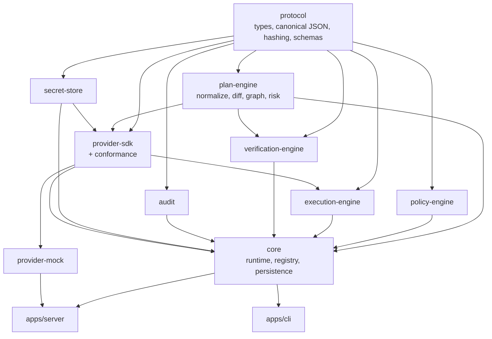

# Architecture

How this implementation is put together, and why it is arranged this way.

## Package graph



`protocol` has no internal dependencies. Dependencies point one way, so a cycle is
a design error rather than a build error.

## What each package owns — and does not

| Package               | Owns                                                                                        | Deliberately does **not** own                                   |
| --------------------- | ------------------------------------------------------------------------------------------- | --------------------------------------------------------------- |
| `protocol`            | types, canonical JSON, SHA-256, JSON Schemas, redaction, limits, error codes, id derivation | any I/O, any storage, any provider knowledge                    |
| `plan-engine`         | normalization, diff, dependency ordering, risk scoring, plan assembly and hashing           | policy (injected), providers, persistence, the clock (injected) |
| `policy-engine`       | rule matching, effects, constraints, bundle hashing                                         | any I/O beyond loading files, any model                         |
| `execution-engine`    | running a plan: retries, backoff, timeouts, cancellation, status                            | deciding _what_ to run, verification, persistence (injected)    |
| `verification-engine` | leaf-by-leaf comparison of desired against observed                                         | reading state (the runtime does that)                           |
| `audit`               | event construction, the hash chain, chain verification                                      | where events are stored (injected)                              |
| `secret-store`        | secret backends, scoped resolution, value containment                                       | which secrets a document needs                                  |
| `provider-sdk`        | the provider contract, contexts, error helpers, the conformance suite                       | any concrete provider                                           |
| `provider-mock`       | four resource types over local SQLite, plus failure simulation                              | diffing, ordering, risk, policy, retries                        |
| `core`                | the registry, the lifecycle, persistence, redaction at the boundary                         | HTTP, CLI rendering                                             |
| `apps/server`         | routes, auth, the error envelope, OpenAPI, env parsing                                      | any protocol logic                                              |
| `apps/cli`            | rendering, exit codes, the HTTP client                                                      | any protocol logic                                              |

The single most important line in that table is that **providers do not own the
diff**. A provider says what exists and what should exist; the runtime decides what
that means.

## Why the runtime owns the diff

If each provider computed its own change set, then determinism, ordering,
immutability handling, risk and blocking would be re-implemented — and
re-implemented differently — for every integration. Instead a provider projects both
sides into a flat set of resource instances, and one generic diff runs over them.

Consequences worth naming:

- **`buildPlan` is nearly pure.** It takes projections, resource types, a policy
  callback and a clock, and returns a plan. It has no I/O, so plan determinism is
  a unit test rather than an integration test.
- **Safety is enforced in one place.** Blocking destructive actions, honouring
  `immutableFields`, detecting cycles and counting blast radius are single
  implementations that every provider inherits.
- **Providers get small.** The mock provider is projection, validation and
  `applyChange`. A real adapter is not much larger.

The cost is that a provider must express its domain as resources with stable keys
and explicit `dependsOn` edges. That modelling step is the hard part of writing a
provider, and [docs/provider-authoring.md](provider-authoring.md) spends most of its
length on it.

## The `plan` path

`DSPRuntime.plan` in [`packages/core/src/runtime.ts`](../packages/core/src/runtime.ts):

```
registry.asDocument(raw)              envelope schema
assertDocumentLimits                  size and depth
registry.kind(...)                    is this kind served?
registry.specValidator(kind)          spec schema
provider.validate(context, document)  semantic rules, no side effects
provider.inspect(context, document)   read the world
provider.normalizeDesired(document)   → projection
provider.normalizeCurrent(current)    → projection
#assertResourceLimits
buildPlan({
  computeChanges                      generic diff
  topologicalOrder                    deterministic ordering
  refineChanges → provider.plan       annotate only; assertRefinement guards it
  withChangeRisk                      per-change risk
  scorePlan                           riskiest change + blast radius
  evaluatePolicies                    injected policy-engine call
  hashCanonical                       planHash → planIdFromHash
})
#preserveValidityWindow               re-plan must not extend an open window
store.savePlan
audit.record('plan.create')
redactPlanForOutput                   the caller never sees a raw secret
```

Nothing in that path writes to the external system.

## The `apply` path

```
findOperationByIdempotency            replay? answer from history, touch nothing
#assertPlanIntegrity                  recompute hash; expiry; executable
#assertPolicyStillAllows              bundle identity, then re-evaluate
#assertApproved                       hash-bound and window-bound approvals
provider.inspect                      read the world again
#assertNoDrift                        revision comparison, plus If-Match
store.reserveIdempotency              atomic claim
store.saveOperation                   'created'
audit.record('plan.apply')
executePlan                           in plan order, with retries and timeouts
  ├─ blocked  → recorded, never executed
  ├─ noop     → skipped without calling the provider
  ├─ deps not succeeded → skipped with an error
  └─ provider.applyChange(context, change)
audit.record('change.apply') per change
#runVerification                      re-read and compare
#applyVerification                    'completed' → 'verification_failed' if unmet
```

The order is not incidental. Idempotency is checked before anything reads the world
because a replayed apply _already changed_ the state it would be compared against —
checking drift first made a legitimate retry look like a conflict, which was a real
bug found by a test.

## Determinism

Three rules keep plans reproducible:

1. **Canonical JSON for every hash.** RFC 8785: sorted keys, preserved array order,
   normalized `-0`, rejected non-finite numbers.
2. **Timestamps are excluded from identity.** `planHash` covers content only.
   `metadata.createdAt`, `metadata.expiresAt` and `metadata.id` are not hashed, and
   `metadata.requestId` is stripped from `desiredStateHash`.
3. **Every ordering has a tie-break.** Resources sort by key, changes sort by
   `(action rank, resource type, resource key)`, policies sort by name.

`metadata.id` is derived from `planHash`, which has a useful side effect: planning
the same thing twice is idempotent at the storage layer instead of accumulating
duplicate plans.

The clock is always injected — `RuntimeConfig`, `MockBackend`, `SqliteRuntimeStore`
and `AuditLog` all take a `now`. So does the retry `sleep`. Tests move time without
waiting for it.

## Persistence

One SQLite database, defined in
[`packages/core/src/store/sqlite-store.ts`](../packages/core/src/store/sqlite-store.ts):

| Table          | Key                                  | Holds                                             |
| -------------- | ------------------------------------ | ------------------------------------------------- |
| `plans`        | `plan_id`                            | the plan, the document it came from, its options  |
| `approvals`    | `(plan_id, approved_by)`             | who approved which hash, when, and why            |
| `operations`   | `operation_id`                       | the operation record including per-change results |
| `idempotency`  | `(tenant, plan_id, idempotency_key)` | the claimed operation id                          |
| `audit_events` | `id`, unique `sequence`              | one audit event per row                           |

Records are stored as JSON with the columns a lookup actually needs lifted out. The
schemas are the contract; a migration framework for a single-file local runtime
would be more machinery than it earns. `reserveIdempotency` relies on
`INSERT … ON CONFLICT DO NOTHING` for atomicity rather than an application-level
lock.

### Why `node:sqlite`

The TZ suggested Prisma or Drizzle. This uses Node's built-in SQLite instead, and
the trade is worth stating:

- **Gained:** zero native build steps, no postinstall, no `better-sqlite3`
  compilation, works offline, and `:memory:` in tests exercises the _same_ code path
  as a file-backed server.
- **Paid:** the API is still marked experimental, so a Node minor could change it.
  Node prints a warning on module load, which is filtered — narrowly, by message —
  in `store/suppress-warnings.ts`.

For a protocol reference implementation that people are expected to clone and run in
one command, cloneability won.

## Extension points

| To change             | Implement                                                        |
| --------------------- | ---------------------------------------------------------------- |
| a new external system | `DSPProvider`, and pass the conformance suite                    |
| where secrets live    | `SecretStore` (+ `createSecretStore`)                            |
| what is allowed       | a policy bundle; `DSP_POLICY_DIR` loads one from disk            |
| where state lives     | `RuntimeStore`, and `AuditStore` for the chain                   |
| how things are logged | the `Logger` interface; `createLogger` is one implementation     |
| the transport         | `DSPRuntime` is transport-agnostic; `apps/server` is one surface |

`DSPRuntime` takes all of these as constructor arguments. `createRuntime` is a
convenience that wires the reference choices; nothing depends on it.

## Testing shape

- **Unit tests** cover the pure pieces: canonical JSON, hashing, paths, redaction,
  diff, graph, risk, plan assembly, policy, the audit chain.
- **Integration tests** drive the real `DSPRuntime` over real SQLite with the real
  mock provider. Only the clock and the retry sleep are faked.
- **HTTP tests** use `app.inject()`, so no port is bound, and validate responses
  against the _published_ schemas in `schemas/` rather than against the types.
- **The conformance suite** is shipped source, not test scaffolding: it lives in
  `packages/provider-sdk/src/conformance` and every provider runs it.
- **A drift test** fails if `schemas/*.json` diverges from its TypeScript source.
