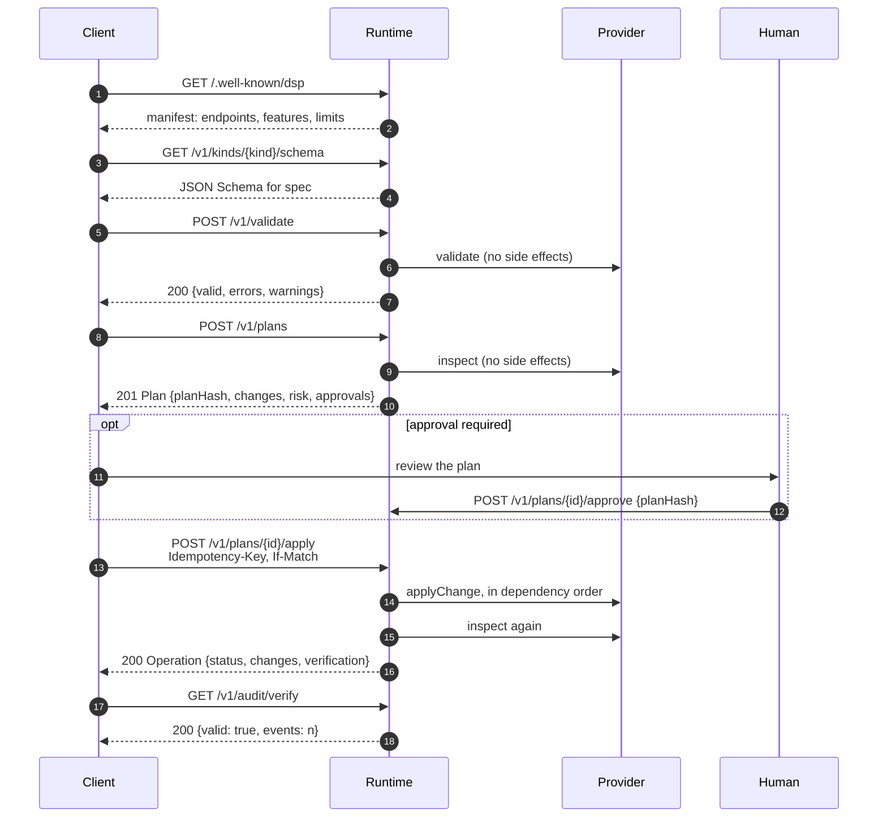

# The DSP wire protocol

A practical walkthrough for someone integrating a client. Every body below was
captured from a running reference runtime. For the normative rules, see
[SPEC.md](../SPEC.md); this document does not restate them.

Base URL in all examples: `http://127.0.0.1:4040`. Authentication is a bearer
token; `/health`, `/.well-known/dsp` and `/openapi.json` are the only endpoints that
do not require one.

## The shape of a session



## 1. Discover

```bash
curl -s http://127.0.0.1:4040/.well-known/dsp
```

```json
{
  "protocol": "dsp",
  "protocolVersion": "0.1.0",
  "server": { "name": "DSP Reference Runtime", "version": "0.1.0" },
  "endpoints": {
    "resourceTypes": "/v1/resource-types",
    "kinds": "/v1/kinds",
    "inspect": "/v1/inspect",
    "validate": "/v1/validate",
    "plan": "/v1/plans",
    "approve": "/v1/plans/{planId}/approve",
    "apply": "/v1/plans/{planId}/apply",
    "verify": "/v1/operations/{operationId}/verify",
    "operations": "/v1/operations/{operationId}",
    "audit": "/v1/audit"
  },
  "features": {
    "planBeforeApply": true,
    "signedPlans": true,
    "idempotency": true,
    "verification": true,
    "auditLog": true,
    "policyEvaluation": true,
    "destructiveChanges": false,
    "driftDetection": true
  },
  "authentication": ["bearer"],
  "limits": {
    "maxDocumentBytes": 524288,
    "maxDocumentDepth": 32,
    "maxResources": 500,
    "maxChanges": 1000,
    "planTtlSeconds": 900
  }
}
```

Read `features` rather than assuming. `destructiveChanges: false` tells a client up
front that a document which removes a resource will produce `blocked` changes.

### Resource types and kinds

```bash
curl -s -H "Authorization: Bearer $DSP_TOKEN" \
  http://127.0.0.1:4040/v1/resource-types/mock.database
```

```json
{
  "apiVersion": "dsp.dev/v1alpha1",
  "kind": "ResourceType",
  "metadata": { "name": "mock.database" },
  "spec": {
    "provider": "mock",
    "description": "A logical database",
    "schemaUrl": "/v1/resource-types/mock.database/schema",
    "capabilities": {
      "inspect": true,
      "plan": true,
      "apply": true,
      "verify": true,
      "delete": false
    },
    "identityFields": ["name"],
    "immutableFields": ["engine"],
    "sensitiveFields": [],
    "riskFactors": {}
  }
}
```

`immutableFields` is the field a client most needs before writing a document: a
change to `engine` on an existing database cannot be an update.

`GET /v1/kinds/{kind}/schema` returns the JSON Schema for `spec`. A client that
validates locally against it will not need a round trip to discover a typo.

| Endpoint                            | Returns                                |
| ----------------------------------- | -------------------------------------- |
| `GET /v1/resource-types`            | `{ items: ResourceType[] }`            |
| `GET /v1/resource-types/{t}`        | one `ResourceType` document            |
| `GET /v1/resource-types/{t}/schema` | JSON Schema for that type's attributes |
| `GET /v1/kinds`                     | `{ items: Kind[] }`                    |
| `GET /v1/kinds/{kind}`              | one `Kind` document                    |
| `GET /v1/kinds/{kind}/schema`       | JSON Schema for that kind's `spec`     |

## 2. Validate

```bash
curl -s -X POST \
  -H "Authorization: Bearer $DSP_TOKEN" \
  -H "Content-Type: application/json" \
  -d @document.json \
  http://127.0.0.1:4040/v1/validate
```

Request body wraps the document under `desiredState`:

```json
{
  "desiredState": {
    "apiVersion": "dsp.dev/v1alpha1",
    "kind": "MockWorkspace",
    "metadata": { "name": "demo" },
    "spec": {
      "databases": [
        {
          "name": "main",
          "engine": "postgres",
          "region": "eu-central-1",
          "tables": [{ "name": "users", "columns": [{ "name": "id", "type": "text" }] }]
        }
      ]
    }
  }
}
```

```json
{ "valid": true, "errors": [], "warnings": [] }
```

An invalid document is **still a `200`**. Validation is an answer, not a failure:

```json
{
  "valid": false,
  "errors": [
    {
      "code": "IMMUTABLE_FIELD_CHANGED",
      "path": "spec.databases[0].engine",
      "message": "Engine cannot be changed for an existing database (current: postgres)"
    }
  ],
  "warnings": [
    {
      "code": "INLINE_SECRET",
      "path": "spec.users[0].apiToken",
      "message": "Inline API tokens are stored as sensitive attributes and redacted, but a secretRef is preferred"
    }
  ]
}
```

Paths use the same dotted-with-indices notation as the rest of the protocol, so a
client can map an error straight back to a line in its document.

A `4xx` from this endpoint means the _request_ was wrong — bad JSON, missing
`desiredState`, an oversized body — not that the document was invalid.

## 3. Inspect

```bash
curl -s -X POST -H "Authorization: Bearer $DSP_TOKEN" \
  -H "Content-Type: application/json" -d @document.json \
  http://127.0.0.1:4040/v1/inspect
```

```json
{
  "resourceType": "MockWorkspace",
  "resourceId": "default/demo",
  "observedAt": "2026-07-29T21:00:18.558Z",
  "revision": "empty",
  "state": { "resources": [] }
}
```

`revision` is the token drift detection compares against. Capture it if you intend
to pin the apply with `If-Match`.

## 4. Plan

```bash
curl -s -X POST -H "Authorization: Bearer $DSP_TOKEN" \
  -H "Content-Type: application/json" -d @document.json \
  http://127.0.0.1:4040/v1/plans
```

Optional `options` alongside `desiredState`:

```json
{ "desiredState": {}, "options": { "allowDelete": false, "allowReplace": false } }
```

`201 Created`:

```json
{
  "apiVersion": "dsp.dev/v1alpha1",
  "kind": "Plan",
  "metadata": {
    "id": "plan_08467877ad57796bf641fddd",
    "createdAt": "2026-07-29T21:00:18.586Z",
    "expiresAt": "2026-07-29T21:15:18.586Z",
    "desiredStateHash": "sha256:8e63ea9f494ba11449172cdeae03b02f69cbf3fc326fd21d85219d19e30141c3",
    "currentStateHash": "sha256:4f53cda18c2baa0c0354bb5f9a3ecbe5ed12ab4d8e11ba873c2f11161202b945",
    "policyBundleHash": "sha256:8b295154552a3e2006fbba81762efc7a38b3781b049cdbd5bf3ecb47a130f752",
    "planHash": "sha256:08467877ad57796bf641fdddf3d1b61245dc176272ad5a40c6b361314886d1df",
    "kind": "MockWorkspace",
    "namespace": "default",
    "resourceName": "demo",
    "provider": "mock",
    "currentRevision": "empty"
  },
  "summary": {
    "create": 2,
    "update": 0,
    "delete": 0,
    "replace": 0,
    "noop": 0,
    "blocked": 0,
    "risk": "low",
    "riskScore": 16
  },
  "changes": [
    {
      "id": "chg_3c04b0fb5cc79d163fec",
      "resourceType": "mock.database",
      "resourceKey": "mock.database/main",
      "action": "create",
      "fields": [],
      "reason": "mock.database \"mock.database/main\" does not exist yet",
      "reversible": false,
      "destructive": false,
      "dependencies": [],
      "estimatedRisk": "low",
      "after": { "engine": "postgres", "name": "main", "region": "eu-central-1" }
    },
    {
      "id": "chg_76dab50c33e8f23433cc",
      "resourceType": "mock.table",
      "resourceKey": "mock.table/main.users",
      "action": "create",
      "fields": [],
      "reason": "mock.table \"mock.table/main.users\" does not exist yet",
      "reversible": false,
      "destructive": false,
      "dependencies": ["chg_3c04b0fb5cc79d163fec"],
      "estimatedRisk": "low",
      "after": {
        "columns": [{ "name": "id", "nullable": false, "type": "text" }],
        "database": "main",
        "name": "users"
      }
    }
  ],
  "approvals": { "required": false, "requirements": [] },
  "policyEvaluation": { "allowed": true, "decisions": [], "requiredApprovals": [] },
  "executable": true
}
```

Things a client should read before doing anything else:

- **`executable`** — `false` means policy denied it. Apply will refuse; nothing will
  change no matter how the request is retried.
- **`approvals.required`** — `true` means a human has to approve this exact hash.
- **`summary.blocked`** — non-zero means some part of the desired state cannot be
  reached. Look at those changes' `blockedBy` and `before`.
- **`changes[].dependencies`** — change ids, already topologically ordered. A client
  does not need to compute order; it is being told the order.
- **`metadata.planHash`** — what gets approved, and what apply re-checks.

Planning is idempotent by content: re-posting the same document against the same
world returns the same `id` and `planHash`, and does not extend the plan's expiry.

**Sensitive values are redacted in this response.** The stored plan keeps real
values because apply needs them and the hash must cover actual intent, so a client
cannot recompute `planHash` from what it received. Verify by id and by the echoed
hash. See [security.md](security.md#a-deliberate-asymmetry).

```bash
curl -s -H "Authorization: Bearer $DSP_TOKEN" \
  http://127.0.0.1:4040/v1/plans/plan_08467877ad57796bf641fddd
```

## 5. Approve

```bash
curl -s -X POST -H "Authorization: Bearer $DSP_TOKEN" \
  -H "Content-Type: application/json" \
  -d '{"approvedBy":"taras","reason":"Reviewed plan","planHash":"sha256:0846..."}' \
  http://127.0.0.1:4040/v1/plans/plan_08467877ad57796bf641fddd/approve
```

```json
{
  "planId": "plan_08467877ad57796bf641fddd",
  "planHash": "sha256:08467877ad57796bf641fdddf3d1b61245dc176272ad5a40c6b361314886d1df",
  "approvedBy": "taras",
  "approvedAt": "2026-07-29T21:00:18.640Z",
  "reason": "Reviewed plan",
  "requirementIds": ["apr_ba4f488fc4a9add6"]
}
```

`planHash` is required, not optional. Sending it is how the caller states which plan
it read. A mismatch is `409 APPROVAL_INVALID` — that is the check that stops an
approval from following a document as it changes underneath.

Where a requirement declares `minApprovals: n`, `n` **distinct** `approvedBy` values
are needed; the same person approving repeatedly still counts once.

## 6. Apply

```bash
curl -s -X POST \
  -H "Authorization: Bearer $DSP_TOKEN" \
  -H "Idempotency-Key: demo-1" \
  -H "If-Match: empty" \
  http://127.0.0.1:4040/v1/plans/plan_08467877ad57796bf641fddd/apply
```

There is no request body. Apply takes a plan id and nothing else.

| Header            | Required | Purpose                                                          |
| ----------------- | -------- | ---------------------------------------------------------------- |
| `Idempotency-Key` | yes      | Replaying it returns the same operation instead of acting twice. |
| `If-Match`        | no       | The revision the client believes in. A mismatch is refused.      |

`200 OK`:

```json
{
  "id": "op_a39cd0afa1acd056b00080f9",
  "tenant": "local",
  "planId": "plan_08467877ad57796bf641fddd",
  "planHash": "sha256:08467877ad57796bf641fddd...",
  "idempotencyKey": "demo-1",
  "status": "completed",
  "actor": { "type": "agent", "id": "anonymous" },
  "createdAt": "2026-07-29T21:00:18.662Z",
  "updatedAt": "2026-07-29T21:00:18.664Z",
  "changes": [
    {
      "changeId": "chg_3c04b0fb5cc79d163fec",
      "resourceType": "mock.database",
      "resourceKey": "mock.database/main",
      "action": "create",
      "status": "succeeded",
      "attempts": 1,
      "startedAt": "2026-07-29T21:00:18.662Z",
      "finishedAt": "2026-07-29T21:00:18.662Z",
      "externalId": "database_46ce02c1310d",
      "providerRequestId": "mockreq_a39cd0af_3c04b0fb",
      "error": null
    }
  ],
  "verification": {
    "operationId": "op_a39cd0afa1acd056b00080f9",
    "status": "satisfied",
    "satisfaction": 1,
    "verifiedAt": "2026-07-29T21:00:18.663Z",
    "matched": [
      "mock.database/main.engine",
      "mock.database/main.name",
      "mock.database/main.region",
      "mock.table/main.users.columns[0].name"
    ],
    "unmatched": []
  },
  "cancellationRequested": false,
  "error": null
}
```

Verification runs automatically. A client does not have to ask whether it worked —
the answer is in the response, derived from re-reading the provider rather than from
the provider's own success report.

Read `status` and `verification.status` together:

| `status`              | `verification.status` | Meaning                                                 |
| --------------------- | --------------------- | ------------------------------------------------------- |
| `completed`           | `satisfied`           | The desired state holds.                                |
| `verification_failed` | not `satisfied`       | Every change reported success, but the world disagrees. |
| `partially_completed` | any                   | Some change failed, was blocked, or was skipped.        |
| `failed`              | any                   | Nothing succeeded.                                      |

`partially_completed` is not an error to retry blindly. Post the same document to
`/v1/plans` again: the new plan will contain only the work still missing.

## 7. Verify, status, cancel

```bash
curl -s -H "Authorization: Bearer $DSP_TOKEN" \
  http://127.0.0.1:4040/v1/operations/op_a39cd0afa1acd056b00080f9
```

```bash
curl -s -X POST -H "Authorization: Bearer $DSP_TOKEN" \
  http://127.0.0.1:4040/v1/operations/op_a39cd0afa1acd056b00080f9/verify
```

Re-verifying is safe and reads the world at that moment, so it doubles as a drift
check on state DSP previously made true.

```bash
curl -s -X POST -H "Authorization: Bearer $DSP_TOKEN" \
  http://127.0.0.1:4040/v1/operations/op_.../cancel
```

Cancelling a finished operation is `409 CANCELLED` rather than a silent no-op.

## 8. Audit

```bash
curl -s -H "Authorization: Bearer $DSP_TOKEN" \
  "http://127.0.0.1:4040/v1/audit?limit=20&planId=plan_08467877ad57796bf641fddd"
```

Query parameters: `limit`, `afterSequence`, `planId`, `operationId`, `action`.
`afterSequence` is the paging cursor.

```json
{
  "items": [
    {
      "id": "evt_...",
      "sequence": 3,
      "timestamp": "2026-07-29T21:00:18.586Z",
      "actor": { "type": "agent", "id": "anonymous" },
      "action": "plan.create",
      "outcome": "success",
      "planId": "plan_08467877ad57796bf641fddd",
      "metadata": { "planHash": "sha256:...", "executable": true },
      "previousEventHash": "sha256:...",
      "eventHash": "sha256:..."
    }
  ]
}
```

```bash
curl -s -H "Authorization: Bearer $DSP_TOKEN" http://127.0.0.1:4040/v1/audit/verify
```

```json
{ "valid": true, "events": 29 }
```

A broken chain reports where:

```json
{
  "valid": false,
  "events": 29,
  "brokenAt": {
    "sequence": 7,
    "eventId": "evt_...",
    "reason": "eventHash does not match the event contents"
  }
}
```

## Failure cases

Every failure uses one envelope, on every endpoint:

```json
{
  "error": {
    "code": "STATE_DRIFT_DETECTED",
    "message": "Current state changed after the plan was created",
    "retryable": false,
    "details": {
      "expectedRevision": "empty",
      "actualRevision": "sha256:934a6707e9728ceb172ce84a61eccf661560c2028c095297401b70cc3f0ada1d"
    },
    "requestId": "req_1cc90c787548f5ef"
  }
}
```

Responses never carry a stack trace, a provider internal or a credential. An
unexpected internal failure is a generic `INTERNAL_ERROR`.

The cases a client will actually meet:

| Code                       | HTTP | What the client should do                                  |
| -------------------------- | ---- | ---------------------------------------------------------- |
| `APPROVAL_REQUIRED`        | 409  | Show the plan to a human; `details.requirements` says why. |
| `APPROVAL_INVALID`         | 409  | Re-read the plan; the hash you approved is not current.    |
| `STATE_DRIFT_DETECTED`     | 409  | Re-plan. Never retry the old plan.                         |
| `PLAN_EXPIRED`             | 409  | Re-plan. Any old approval will no longer count.            |
| `PLAN_NOT_EXECUTABLE`      | 409  | Policy denied it. Fix the document or the policy.          |
| `POLICY_DENIED`            | 403  | Same, or the policy bundle changed since planning.         |
| `IDEMPOTENCY_KEY_REQUIRED` | 400  | Send `Idempotency-Key`.                                    |
| `PROVIDER_TIMEOUT`         | 504  | Retryable. The runtime already retried internally.         |
| `DOCUMENT_TOO_LARGE`       | 413  | Split the document; see `limits` in the manifest.          |
| `UNAUTHORIZED`             | 401  | Check the bearer token.                                    |

`retryable` is authoritative. Do not retry a request whose error says `false`; the
answer will not change.

## Attribution headers

| Header             | Values                     | Effect                                              |
| ------------------ | -------------------------- | --------------------------------------------------- |
| `X-DSP-Actor-Type` | `human`, `agent`, `system` | Recorded in the audit log. Defaults to `agent`.     |
| `X-DSP-Actor-Id`   | any string, max 128 chars  | Recorded in the audit log. Defaults to `anonymous`. |

These are attribution only. They grant nothing — the bearer token decides what is
permitted. An unrecognized actor type falls back to `agent` rather than erroring.

## Machine-readable description

```bash
curl -s http://127.0.0.1:4040/openapi.json
```

An OpenAPI 3.1 document that reuses the published DSP schemas from
[`schemas/`](../schemas) rather than restating them, so the HTTP contract and the
protocol contract cannot drift apart. A test asserts that every served route appears
in it and that it documents no route the server does not serve.
